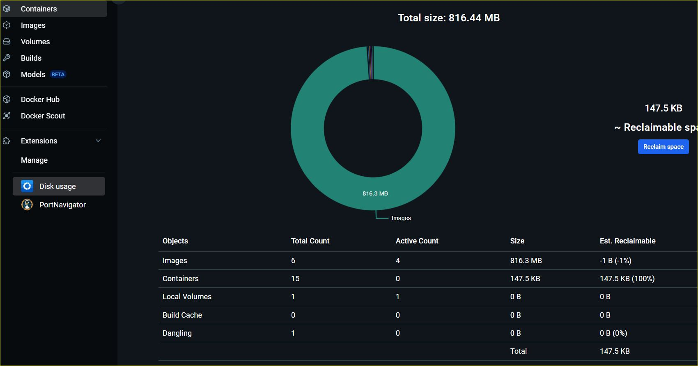

# Tarea Evaluable Docker - Ejercicio 1

> Ejercicio 1 - Contenedores en red y Docker
> Desktop
>
> Realizado por ORTIZ GONZALEZ Fernando

[TOC]

## Configuraciones previas

Se debe crear un repositorio GitHub - debe ser público:

[Visualizar repositorio público aquí](https://github.com/Ortiz-Fernando/cursoDocker)

- Creación del repositorio en GitHub


- Clonar repositorio en carpeta local


- Configuración de ramas para cada ejercicio y su commit al repositorio.


## 1. Crea una red bridge `redej1`

Luego de instalar la extension solicitada en los *pasos previos*  para la realizacion del ejercicio 1. Dentro de la extensión abrimos el panel de *network* y procedemos a crear la rede de tipo *bridge*`redej1`. En la misma se conectaran los contenedores creados posteriormente.


## 2. Crea un contenedor con una imagen de ``mariaDB`` 

Crea un contenedor con una imagen de mariaDB que estará en la red **redej1** . Este contenedor se ejecutará en segundo plano, y será accesible a través del puerto 3306.

Se realiza una descarga de la imagen mariaDB del DockerHub y luego se genera el contenedor (*run*) comom se muestra en las imágenes.


- Definir una contraseña para el usuario root (elegimos *root*) , y un usuario con tu nombre de pila **fernando** y con contraseña **123123**. La BD por defecto será **DAW**

  

  

  

- Genera un *script SQL* que cree una tabla *módulos* con algunos registros con los nombres de los módulos que estás estudiando (DIW, DWES, DWEC)

```sql
CREATE TABLE modulos (
id INT AUTO_INCREMENT PRIMARY KEY,
nombre VARCHAR(50) NOT NULL
);
INSERT INTO modulos (nombre) VALUES
('DIW'),
('DWEC'),
('DWES'),
('DAW');

```


## 3. Crear un contenedor con ``Adminer``

- Crear un contenedor con ``Adminer`` que se pueda conectar al contenedor de la BD.

  

  

  

- Descargamos la imagen correspondiente del Hub y luego *corremos* el nuevo contenedor y realizamos la conexión a la red junto a el contenedor de **mariaDB**.

  

  


## 4. Mostrar BD y tablas creadas

Desde la interfaz gráfica elegida, conéctate a la BD con tu usuario personal, ejecuta el script con los datos de los módulos y muestra la BD y la tabla creados

​		

​		


​		


## 5. Opcion elegida: Disk Usage

- Instala la extensión **Disk Usage**. 

- Muestra el espacio ocupado.

  

- Borramos red, contenedores y volumen ocupado por las persistencias.

  

  

​	

Se puede observar la diferencia en *Containers* y el *Total Size* que analiza la extensión para observar la eliminación de archivos, imágenes, red y contenedores.


