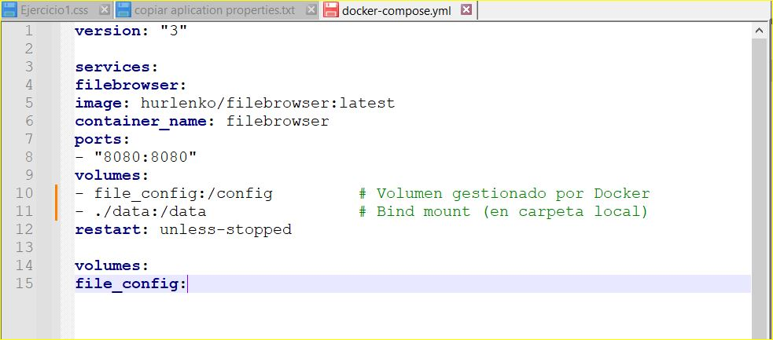
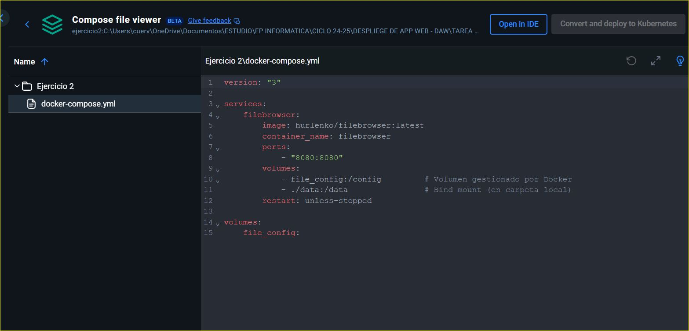
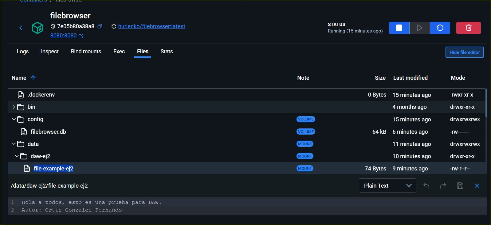
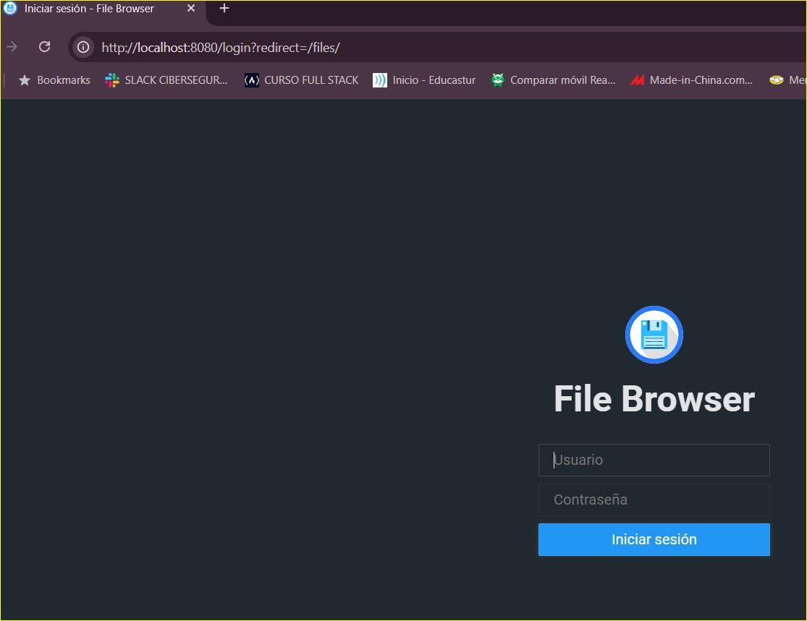
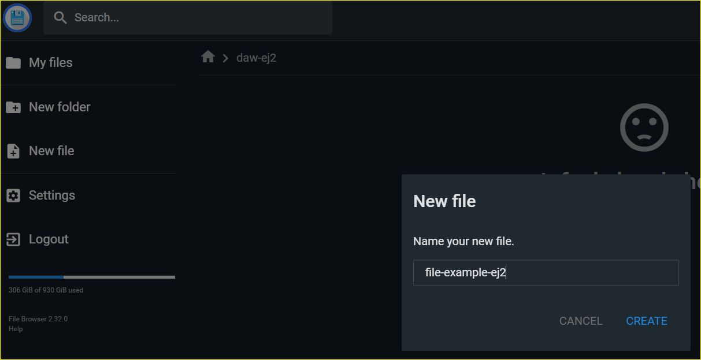
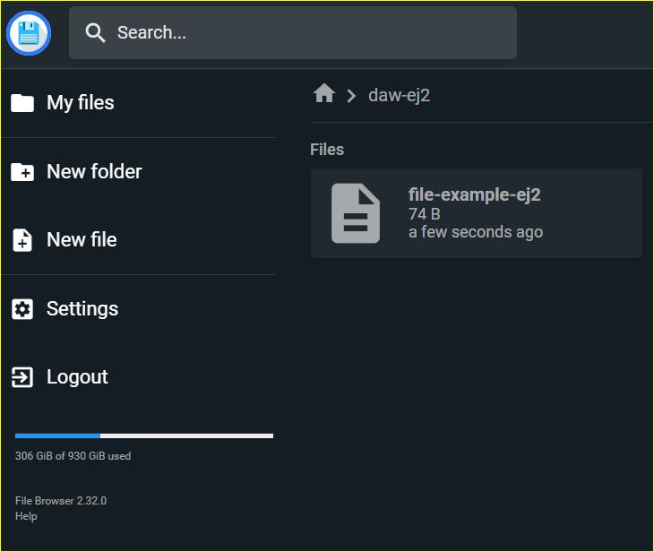
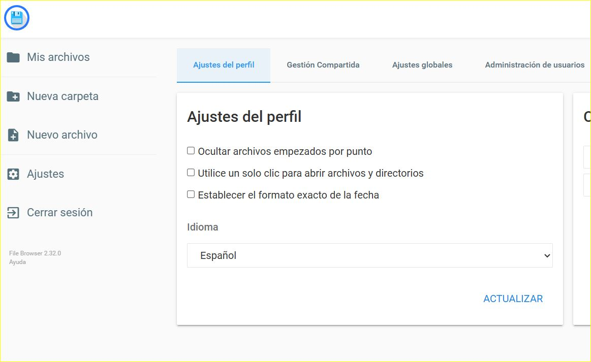

# Ejercicio 2 - Docker Compose

> Este ejercicio se puede resolver utilizando comandos, o Docker Desktop,
> o combinando ambos
> Explorar la imagen de la aplicación FileBrowser en este repositorio en
> GitHub: https://hub.docker.com/r/hurlenko/filebrowser
> El usuario por defecto es admin con contraseña 'admin'
>
> Realizado por ORTIZ GONZALEZ Fernando

----------------------------

--- **TABLA DE CONTENIDOS** ---

[TOC]

-----------------------------------

## Aplicación FileBrowser

Explicación breve de cómo funciona esta aplicación y qué hace.

La aplicación permite gestionar y visualizar archivos y directorios desde un navegador web (localhost en este caso), como si fuera un explorador de archivos (parecido al *Explorador de Windows* , permitiendo subir, descargar, renombrar y eliminar archivos. Además, se puede compartir, limitar el acceso por contraseña, crear usuarios y privilegios, limitar el tiempo que se comparte y muchas otras funciones. 

## Escribir un fichero ``compose.yaml``

1. Escribir un fichero ``compose.yaml`` para desplegarla. Los datos se pueden guardar utilizando volúmenes (/config) y utilizando bind-mount (/data).

​	

## Almacenamiento en FileBrowser

- Captura de pantalla donde se vean los volúmenes/carpetas donde se han almacenado los datos.

## Cambios en FileBrowser

- Captura de pantalla donde se vea la aplicación funcionando, sube algún fichero, cambia el lenguaje a español, cambio de tema a colores claros.

​	

