<<<<<<< HEAD
# Tarea 3

> Realizado por ORTIZ GONZALEZ Fernando

[TOC]

## Trabajo Local

1. 
=======
# Ejercicio 3 - Imagen con Dockerfile 
Aplicación web

> Para la realización de este ejercicio es necesario tener una cuenta en
> Docker Hub.
> Este ejercicio se puede resolver utilizando comandos, o Docker Desktop,
> o combinando ambos
>
> Realizado por ORTIZ GONZALEZ Fernando

----------------------------

--- **TABLA DE CONTENIDOS** ---

[TOC]

-----------------------------------

## Escribir un fichero ``Dockerfile``

Necesitamos un fichero **Dockerfile** que automatice las siguientes operaciones para crear una imagen que contenga un servidor con un sitio web y un script php. Características de la imagen:


- Usa un contenedor que ejecute una instancia de la imagen ``php:7.4-apache`` , que se llame ``ejercicio3`` y que sea accesible desde un navegador en el puerto 8000.

  

  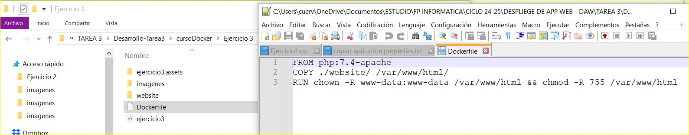

  *Aqui se observa el fichero Dockerfile que es el encargado desde un ``apache:7.4`` copiar el directorio del website a la configuracion de ``PHP``  para poder ejecutar el ``index.html`` y el ``fecha.php``.*

  

- Coloca en el directorio raíz del servicio web ( ``/var/www/html`` ) un "sitio web" donde figure tu nombre - el sitio deberá tener al menos un archivo``index.html`` sencillo y un archivo ``.css``

  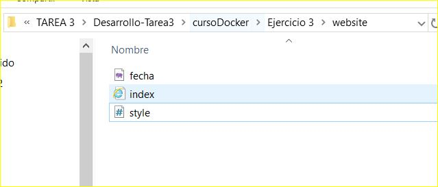

- Coloca en ese mismo directorio raíz el siguiente script php , llámalo ``fecha.php``

```php
<?php
setlocale(LC_TIME, "es_ES.UTF-8");
$mes_actual = strftime("%B");
$fecha_actual = date("d/m/Y");
$hora_actual = date("H:i:s");
echo "<h1>Información< h1>";
echo "<p>Hoy es $fecha_actual< p>";
echo "<p>El mes es: <strong>$mes_actual< strong>< p>";
echo "<p>Hora: $hora_actual< p>";
?>
```

- Ver la salida del script ``fecha.php`` y de la página ``index.html`` en el navegador.

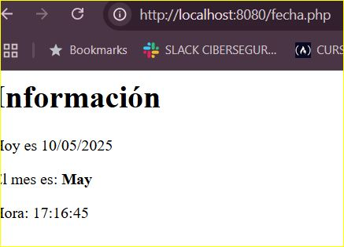

Vista de la salida por el navegador del script ``fecha.php``, desde el contenedor creado con la imagen inicial automatizada por el fichero **Dockerfile**.


## Subir a la cuenta de Docker Hub

**Una vez creada la imagen, súbela a tu cuenta de Docker Hub**

- Borra la imagen de tu Docker local

  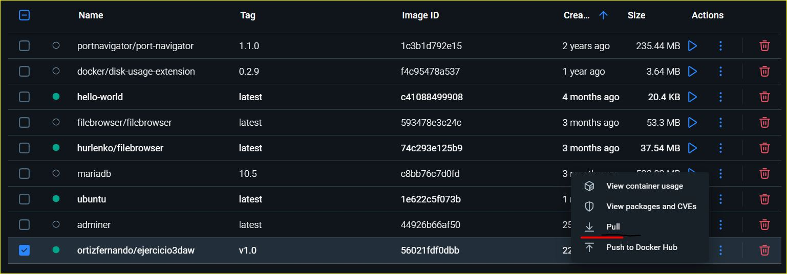

- Baja ('pull') de tu cuenta la imagen que acabas de subir

  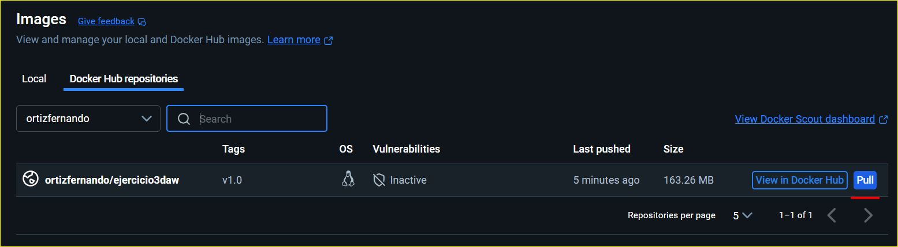

- Muestra las imágenes que tienes

  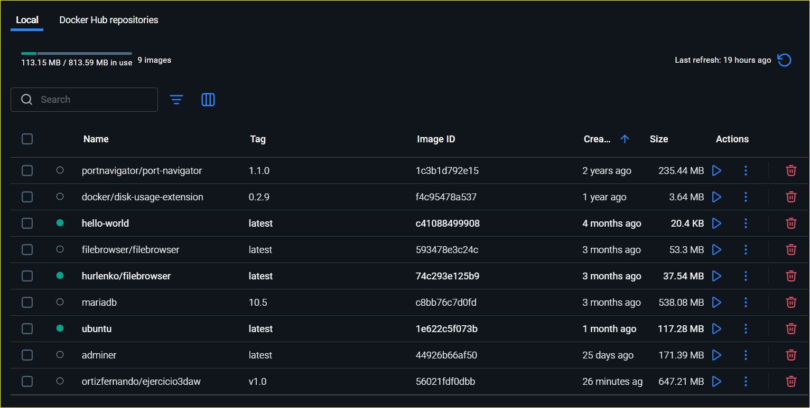

- Ejecuta un contenedor usando esa imagen coonfigurado en el puerto ``1234:80`` en lugar del ``8080:80`` como el inicial.

  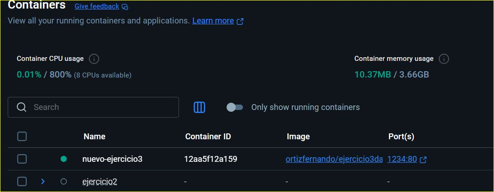


## Capturas de pantalla

- Creación inicial de la imagen inicial a partir del siguiente script:

  ```bash
  docker build -t ortizfernando/ejercicio3:v1.0
  ```

  *Con este ``script`` indicamos a Docker que construiremos en el usuario (**ortizfernando**), la imagen **ejercicio3**, en su **version 1.0**. La cual dará como salida la siguiente imagen, permitiendo su **run** del contenedor inicial para desplegar.*

  

  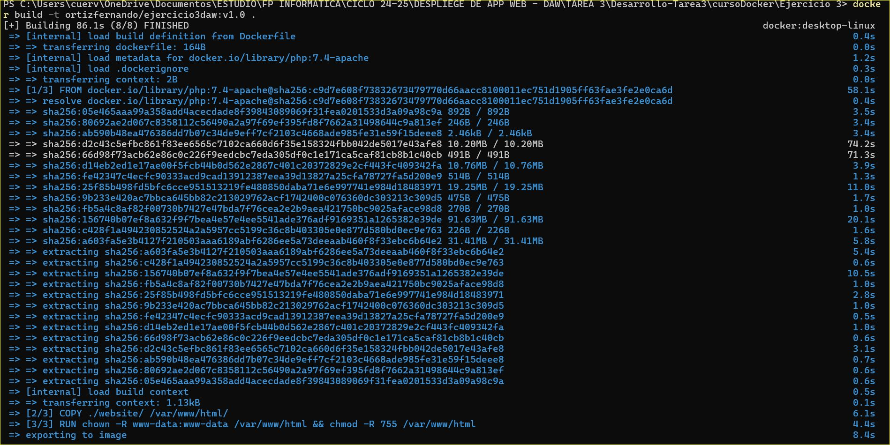

​	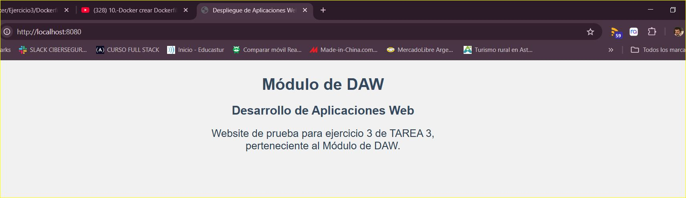


- Creación de la nueva imagen.

  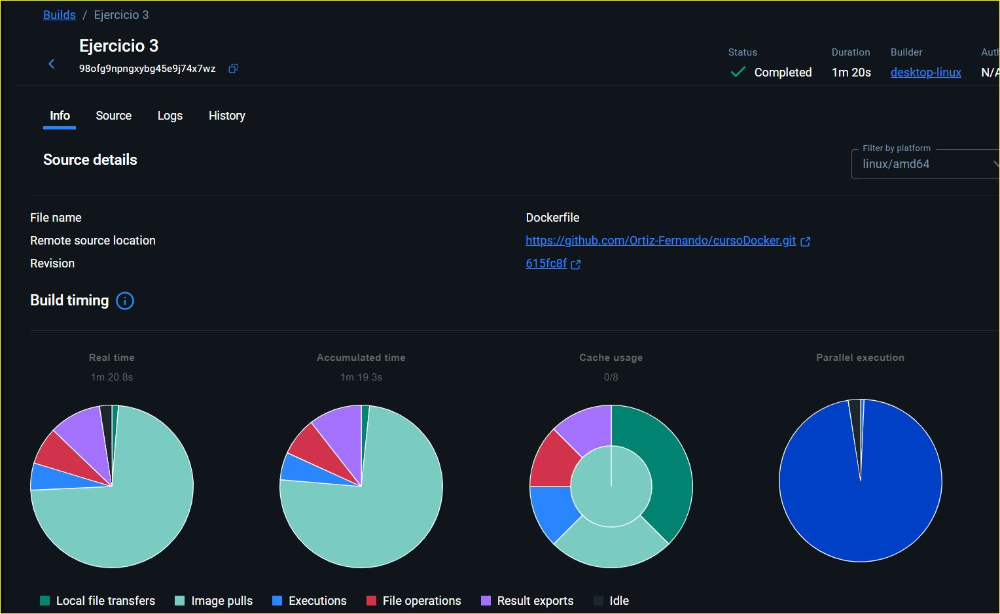

- Subida de la imagen a tu cuenta de Docker Hub.

  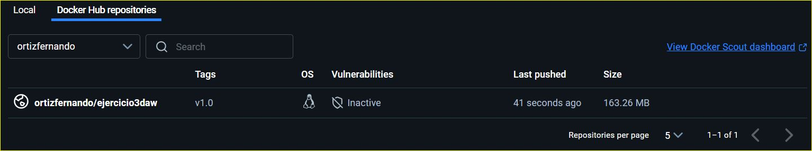

- Acceso al navegador con la página ``html`` y con el script ``php``

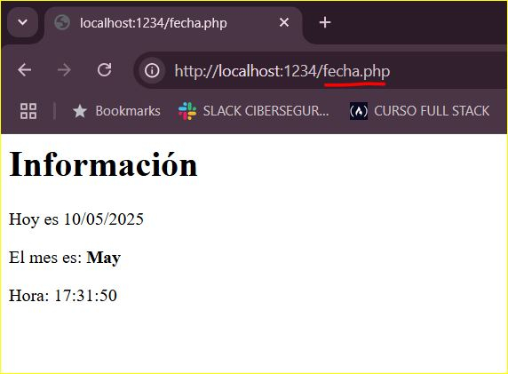

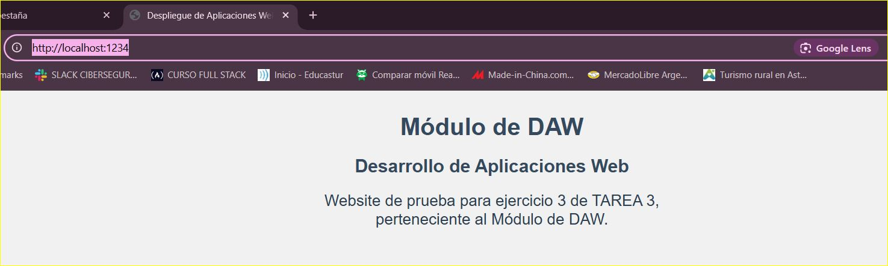


# Videoclip

## **Enlace del videoclip**

- Incluye: presentación, entrada a GitHub, muestra de uno de los ejercicios de Docker.

  
>>>>>>> ejercicio3
